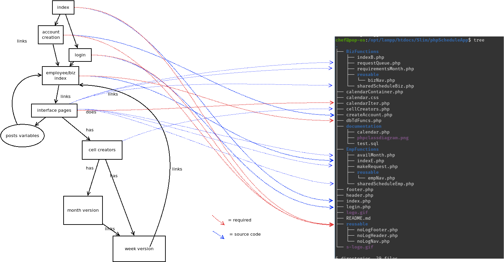

<!--Connor Was Here-->
# phpScheduleApp

I have made numerous changes to the database per our discussion.

makeMonth and makeWeek have been eliminated. There is one calendar creator that takes an arg "week" to make a week, otherwise it makes a month.

Examine the cellCreators file, all database query and acquisition happens in them.

form submissions should happen in the interface pages, and they'll route to the indexE.php

Examine the indexE.php file. It catches all of the POST for employee functions, that it where database submission happens.

The class diagram has been updated, it is attached to this document

 
STUFF TO DO:
<ul><li>
Pull the new repository!
</li>SQL work
<ul><li>
Import the test.sql (its in documentation) THEN 
</li><li> 
Change the name of the database field from 'mondate' to 'sundate' in requirements and schedule THEN 
</li><li>
Push it back up to the git so I have it. THEN 
</li><li>
import the file to your instance of the database
</li>
</ul>
<li>
Add buttons for MakeDefault in availability and schedule builder
<li>
Get logging in functionality working 
</li><li>
The the request process needs everything. requestQue needs a page, a databse construct, and a a page in makeRequest
</li><li>
</li><li>
Add more list items
</li>

</ul></li></ul>

Please examine the class diagram, it's here in the repo.  

wireframes:

https://wireframe.cc/uaR6wf 
https://wireframe.cc/Sjnrnh 
https://wireframe.cc/MLTub4 
https://wireframe.cc/U1NegW 
https://wireframe.cc/MBJAVK 
https://wireframe.cc/LfUwj7 
https://wireframe.cc/BnNRX5 

https://github.com/SoundsProfessional/phpScheduleApp

